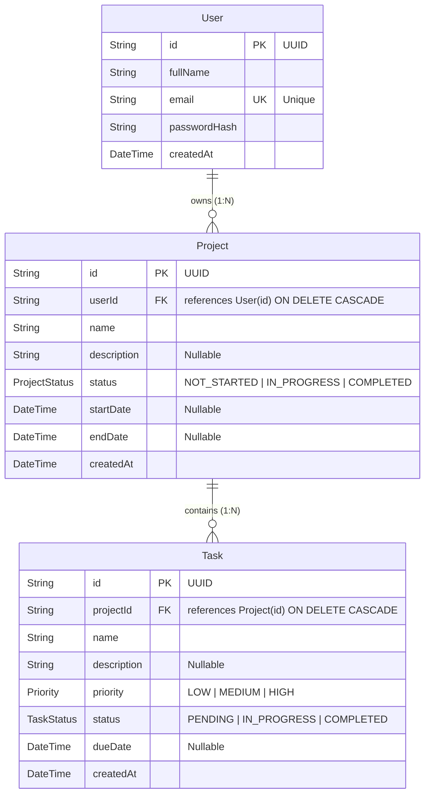

# Project Management System (Web + Mobile + REST API)

A full-stack, cross-platform Project Management application featuring a centralized **Node.js/Express + PostgreSQL** backend, a responsive **React + Vite** web client, and an Android-first **Flutter** mobile application.

Both web and mobile clients communicate with the same backend database in real-time, allowing users to seamlessly transition between desktop and phone.

---

## 🔗 Project Links & Submission Details

- **GitHub Repository**: [https://github.com/Yashk-15/Task.git](https://github.com/Yashk-15/Task.git)
- **Deployed Backend API**: `https://backend-for-project-management.onrender.com/api`
- **Backend Health Check**: `https://backend-for-project-management.onrender.com/api/health`
- **Compiled Android Release APK**: `mobile/build/app/outputs/flutter-apk/app-release.apk`
- **Database**: PostgreSQL (Neon Cloud Serverless) managed via Prisma ORM

---

## 🏛️ System Architecture

```mermaid
graph TD
    subgraph Clients
        Web["Web App (React + TypeScript + Vite)"]
        Mobile["Mobile App (Flutter / Android)"]
    end

    subgraph Backend Services
        API["Express REST API (TypeScript)"]
        Auth["JWT Auth & Rate Limiter"]
        Validate["Zod Input Validation"]
    end

    subgraph Database
        Postgres[("PostgreSQL (Neon Cloud DB)")]
        Prisma["Prisma ORM Client"]
    end

    Web -->|HTTP / JSON (Bearer JWT)| API
    Mobile -->|HTTP / JSON (Bearer JWT)| API
    API --> Auth
    API --> Validate
    API --> Prisma
    Prisma --> Postgres
```

---

## 📋 Features & Functional Compliance

### 1. User Authentication
- **Registration**: Full Name, unique Email, password validation (min 8 chars, letter + number).
- **Security**: Passwords hashed using `bcrypt` (10 rounds); never stored in plain text.
- **Login & Persistence**: Issues signed JWT token. Web stores in `localStorage`; mobile stores in hardware-backed `FlutterSecureStorage` (Android Keystore).
- **Cross-Platform Single Sign-On**: A user registered on web can log in on mobile and vice versa.
- **Session Expiry (401 Handling)**: Auto-redirects to login with a user-friendly expiration message.
- **Rate Limiting**: Brute-force protection on `/api/auth/register` and `/api/auth/login`.

### 2. Project Management
- **CRUD Operations**: Create, view details, update, and delete projects.
- **Cascade Deletion**: Deleting a project automatically deletes all associated tasks via PostgreSQL `ON DELETE CASCADE`.
- **Search & Filters**: Debounced search by project name; filter by status (`NOT_STARTED`, `IN_PROGRESS`, `COMPLETED`).
- **Data Scoping**: Users strictly see and modify only projects they own.

### 3. Task Management
- **Task Attributes**: Name, description, priority (`LOW`, `MEDIUM`, `HIGH`), status (`PENDING`, `IN_PROGRESS`, `COMPLETED`), due date, created date.
- **CRUD & Quick Toggle**: Create, edit, delete tasks, and quickly toggle completion status.
- **Optimistic UI (Mobile)**: Immediate UI updates upon task completion toggle with automatic rollback if the API request fails.
- **Cross-Project & Project-Specific Views**: View tasks across all projects or drill down into a specific project.

### 4. Real-Time Dashboard
- **Aggregate Metrics**:
  - Total Projects
  - Total Tasks
  - Completed Tasks
  - Pending Tasks
  - Projects In Progress
- **Pull-to-Refresh**: Available on mobile with non-blocking background progress indicator.

---

## 🗄️ Database Schema & ER Diagram

The database uses PostgreSQL managed with Prisma ORM.

### Entity Relationship Diagram (ERD)



---

## 📡 REST API Documentation

Base URL: `https://backend-for-project-management.onrender.com/api` (or `http://localhost:5000/api` locally).  
All protected routes require: `Authorization: Bearer <JWT_TOKEN>`.

### Authentication Endpoints

| Method | Endpoint | Description | Auth Required |
|---|---|---|---|
| `POST` | `/api/auth/register` | Register new user account | No |
| `POST` | `/api/auth/login` | Login and receive JWT token | No |
| `POST` | `/api/auth/logout` | Invalidate / acknowledge client logout | Yes |
| `GET` | `/api/auth/me` | Fetch current logged-in user profile | Yes |

### Project Endpoints

| Method | Endpoint | Description | Query Parameters |
|---|---|---|---|
| `GET` | `/api/projects` | List owned projects | `page`, `limit`, `search`, `status`, `sortBy`, `order` |
| `GET` | `/api/projects/:id` | Get project by ID | — |
| `POST` | `/api/projects` | Create a new project | Body: `name`, `description?`, `status?`, `startDate?`, `endDate?` |
| `PUT` | `/api/projects/:id` | Update owned project | Body: fields to update |
| `DELETE` | `/api/projects/:id` | Delete owned project and its tasks | — |

### Task Endpoints

| Method | Endpoint | Description | Query Parameters |
|---|---|---|---|
| `GET` | `/api/tasks` | List tasks across owned projects | `projectId`, `search`, `status`, `priority`, `page`, `limit` |
| `GET` | `/api/tasks/:id` | Get task by ID | — |
| `POST` | `/api/tasks` | Create task under an owned project | Body: `projectId`, `name`, `description?`, `priority?`, `status?`, `dueDate?` |
| `PUT` | `/api/tasks/:id` | Update task | Body: fields to update |
| `DELETE` | `/api/tasks/:id` | Delete task | — |

### Dashboard Endpoint

| Method | Endpoint | Description | Response Shape |
|---|---|---|---|
| `GET` | `/api/dashboard` | Aggregated user metrics | `{ totalProjects, totalTasks, completedTasks, pendingTasks, projectsInProgress }` |

---

## 🚀 Setup & Execution Guide

### 1. Backend Setup

```bash
cd backend
npm install

# Configure environment variables:
cp .env.example .env
# Edit .env with your DATABASE_URL and JWT_SECRET

# Run database migrations:
npx prisma migrate deploy

# (Optional) Seed test data:
npx tsx prisma/seed.ts

# Start development server:
npm run dev
# Running on http://localhost:5000
```

### 2. Web Application Setup

```bash
cd web
npm install

# Configure environment:
cp .env.example .env
# Set VITE_API_URL=http://localhost:5000/api (or the deployed Render URL)

# Start Vite dev server:
npm run dev
# Access at http://localhost:5173
```

### 3. Mobile App (Flutter) Setup

```bash
cd mobile
flutter pub get

# Run against deployed cloud backend (default):
flutter run

# Run against local backend on Android Emulator:
flutter run --dart-define=API_URL=http://10.0.2.2:5000/api

# Run against local backend on Physical Device:
flutter run --dart-define=API_URL=http://<YOUR_LAN_IP>:5000/api

# Build standalone Release APK:
flutter build apk --release --dart-define=API_URL=https://backend-for-project-management.onrender.com/api
```
The output APK is generated at:
`mobile/build/app/outputs/flutter-apk/app-release.apk`

---

## 🔒 Security Practices Implemented

- **Password Hashing**: `bcryptjs` with salt work factor 10.
- **SQL Injection Prevention**: Prisma ORM uses parameterized queries exclusively.
- **Strict User Scoping**: All queries enforce `userId` filter matching the authenticated token. Foreign resource access returns `404 Not Found` (never `403` to prevent ID enumeration).
- **Secure Token Storage**: Mobile stores tokens in the Android Keystore via `flutter_secure_storage`.
- **Brute Force Protection**: IP rate limiting on auth endpoints using `express-rate-limit`.
- **Security Headers**: `helmet` enabled for HTTP defense in depth.
- **Input Validation**: Strict Zod schemas validating types, enums, dates, and email formats.
